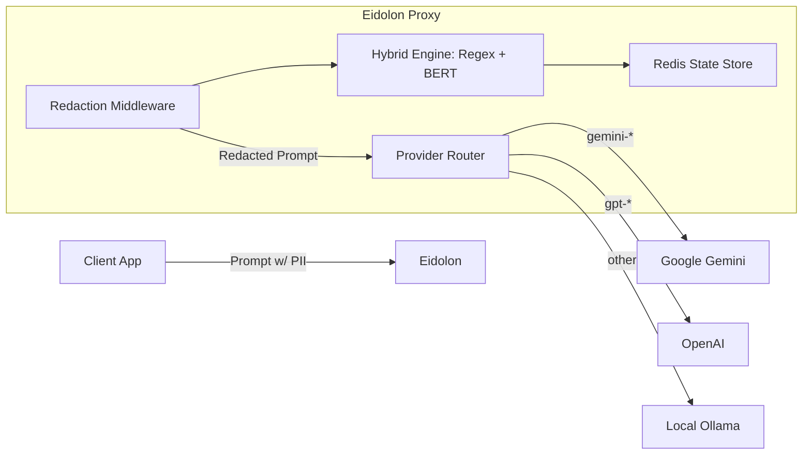

# Eidolon: System Documentation & Production Guide

## 1. Project Overview

**Eidolon** is a specialized high-performance reverse proxy designed to intercept, analyze, and redact Personally Identifiable Information (PII) from Large Language Model (LLM) prompts *before* they leave your secure infrastructure.

It acts as a middleware gateway between your applications and external LLM providers (OpenAI, Google Gemini) or internal models (Ollama).

### Key Features
-   **Hybrid Redaction Engine**:
    -   **Regex**: Deterministic detection of Email, Credit Cards, IPv4, SSN, and generic API Keys.
    -   **NLP (BERT)**: Context-aware Named Entity Recognition (NER) for Names (PER), Locations (LOC), and Organizations (ORG).
-   **Multi-Provider Routing**:
    -   `gemini-*` → Google Gemini API (via Native Adapter)
    -   `gpt-*`, `text-*` → OpenAI API
    -   *Other* → Local Ollama / Open Source models
-   **Stateful Context**: Uses Redis to map `REAL_VALUE` ↔ `SYNTHETIC_ID` (e.g., `John Doe` ↔ `PER_8f3a1c2d`). This allows consistent re-injection of original data into the LLM's response.

---

## 2. Architecture

The system is built in **Rust** using the `Axum` web framework and `Tokio` async runtime.

### Component Diagram



### Core Modules
-   **`src/api/handlers.rs`**: Main entry point. Handles routing, request/response transformation, and error mapping.
-   **`src/middleware/redaction.rs`**: Intercepts the request body, calls the NLP/Regex engine, replaces PII with synthetic IDs, and forwards the modified request.
-   **`src/engine/nlp.rs`**: Wraps the **ONNX Runtime** to execute the BERT NER model.
-   **`src/state/redis.rs`**: Manages the mapping of Synthetic IDs.

---

## 3. Configuration

Eidolon is configured via `config.toml` or Environment Variables. Environment variables use double underscores (e.g., `SERVER__PORT` overrides `[server] port`).

### Default `config.toml`
```toml
[server]
port = 3000
host = "0.0.0.0"

[redis]
url = "redis://127.0.0.1:6379"
ttl_seconds = 86400  # 24 hours

[security]
fail_open = false    # If true, passes traffic even if redaction fails (Not Recommended for prod)

[logging]
level = "info"

[ollama]
base_url = "http://localhost:11434"
```

### Environment Overrides
-   `SERVER__PORT=8080`: Change listening port.
-   `REDIS__URL=redis://redis-production:6379`: Production Redis endpoint.
-   `OLLAMA__BASE_URL=http://lb-ollama:11434`: Upstream Ollama load balancer.

---

## 4. Production Deployment

To run Eidolon in a production environment, follow these hardening and deployment steps.

### 4.1 Building for Release
The default `cargo build` produces a debug binary (slow, large). For production, use the `release` profile which includes LTO (Link Time Optimization) and symbol stripping.

```bash
cargo build --release
```
The binary will be located at `target/release/eidolon`.

### 4.2 Docker Deployment (Recommended)
Use a multi-stage Dockerfile to create a minimal, secure image.

**Dockerfile:**
```dockerfile
# Builder Stage
FROM rust:1.80-slim-bullseye as builder
WORKDIR /app
COPY . .
RUN cargo build --release

# Runtime Stage
FROM debian:bullseye-slim
WORKDIR /app
# Install system dependencies
RUN apt-get update && apt-get install -y libssl1.1 ca-certificates && rm -rf /var/lib/apt/lists/*

# Copy Binary
COPY --from=builder /app/target/release/eidolon .
# Copy Assets (Model)
COPY assets/ assets/
# Copy Config (Optional, or use ENVs)
COPY config.toml .

# For Linux, ensure you have the correct libonnxruntime.so
# COPY libonnxruntime.so /usr/lib/

CMD ["./eidolon"]
```

### 4.3 Runtime Requirements
1.  **Redis**: A persistent Redis instance is required. Ensure high availability (AWS ElastiCache or Redis Cluster) for production.
2.  **ONNX Runtime**: The binary requires the ONNX Runtime shared library:
    -   **Linux**: `libonnxruntime.so` (placed in `/usr/lib/` or `LD_LIBRARY_PATH`).
    -   **Windows**: `onnxruntime.dll` (in the same folder as the executable).
3.  **NLP Model**: The `assets/bert-ner-quantized.onnx` file must be accessible to the application at startup.

### 4.4 Observability
-   **Logging**: The application logs in JSON format when `RUST_LOG=json` is set (needs `tracing-subscriber` JSON feature enabled). Default is human-readable info logs.
-   **Health Check**: Monitor `GET /health` (returns `200 OK`) and connection health to Redis.

---

## 5. Security Best Practices

1.  **Network Isolation**:
    -   Do not expose Eidolon directly to the public internet. Run it behind an API Gateway or Internal Load Balancer.
    -   Restrict egress traffic to only approved endpoints (`api.openai.com`, `generativelanguage.googleapis.com`, internal Ollama).
2.  **Authentication**:
    -   Eidolon currently **passes through** Authorization headers.
    -   **Recommendation**: Terminate authentication at your Gateway (e.g., Nginx, Kong, AWS API Gateway) *before* traffic reaches Eidolon.
3.  **Secrets**:
    -   Inject `REDIS_URL` and `OLLAMA_BASE_URL` via a secret manager (K8s Secrets, AWS Secrets Manager).

---

## 6. Development & Testing

### Running Integration Tests
To verify the redaction pipeline without hitting external APIs:
```bash
cargo test --test redaction_test -- --nocapture
```

### Adding New Providers
1.  Modify `src/config.rs` to add new provider settings.
2.  Update `src/api/handlers.rs` to add routing logic based on `payload.model`.
3.  Implement a new adapter module (like `src/api/gemini.rs`) if the provider API is not OpenAI-compatible.
